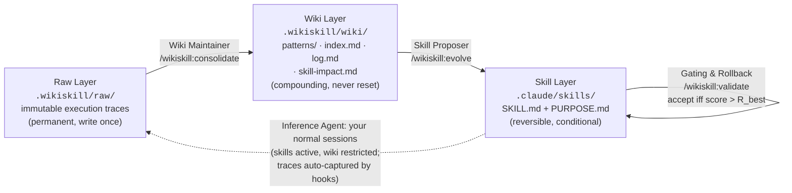

# WikiSkill

**Auto-evolving agent skills for Claude Code and opencode**, a faithful
implementation of *"WikiSkill: Compiling Agent Experience into Persistent
Knowledge for Skill Evolution"* ([arXiv:2608.27454](https://arxiv.org/abs/2608.27454),
Google Research & Virginia Tech) — extended into a fully automated, self-pacing
loop for day-to-day development.

Most skill-evolution setups collapse what an agent has learned into scattered
optimization history. WikiSkill's key idea is a strict **three-layer workspace**
with an orchestrated evolution loop over it (paper Figure 2 / Algorithm 1):



- **Raw Layer** — every session is captured automatically (Claude Code `Stop`
  hook / opencode `session.idle` plugin) as a digest **plus** a raw execution
  log for deep root-cause analysis, with the session's token usage and the
  skills it invoked. Immutable, git-ignored.
- **Wiki Layer** — the Wiki Maintainer consolidates a stratified sample of
  traces (≤5 failing + ≤3 passing per iteration, per the paper's Appendix C)
  into pattern pages (failure *and* success patterns, 10–30 lines, root cause +
  concrete fixes), a one-line-per-pattern index, an evolution log, and a
  **skill-impact tracker** that the CLI appends to programmatically — every
  proposal's unified diff, validation score, and Accepted/Rejected outcome.
  The wiki is **never rolled back**; the paper's ablation attributes the gains
  to exactly this persistence.
- **Skill Layer** — the Skill Proposer makes **one atomic proposal per
  iteration** (create / patch / honest no-action), grounded in the wiki and
  forbidden from repeating any rejected diff recorded in `skill-impact.md`.
  Each skill is `SKILL.md` (When to Apply / When NOT to Apply / Instructions)
  plus `PURPOSE.md` (Origin / Patterns Addressed / Evolution History).
  Snapshots are taken before every change; gating accepts a change only if the
  validation score **strictly beats R_best**, else it rolls back — while the
  wiki keeps what was learned, including the failure itself.

Two paper-faithful details worth knowing: new sessions do **not** get the wiki
injected (the paper's §5.1 ablation shows inference-time wiki access degrades
evolved-skill quality — opt in via `inject_wiki_context` in config), and
evolution pauses when R_best reaches 1.0 — but only until harvesting adds a
new trace-derived validation task, which re-anchors R_best and resumes it.

## What's new

| Version | Highlights |
|---|---|
| **0.7.0** | **Bounded validation suite.** Per-task outcomes (`record-validation --results`), saturation detection (`suite-report`), and retirement of always-green tasks into `validation/retired.md` with regression guards kept (`retire-saturated`). Validation cost stays flat as tasks keep getting harvested. |
| **0.6.0** | **Skill usage & usefulness statistics.** A `PostToolUse(Skill)` hook logs every skill invocation; the Stop hook records errors that follow each skill's use; `/wikiskill:skills` yields HELPFUL / SUSPECT / UNUSED verdicts that the Maintainer and Proposer act on. |
| **0.5.0** | **Evolution deadlock fixed.** A small all-green suite froze R_best at 1.0 forever. Now tasks are harvested from daily traces *every* iteration (failure-derived first), and R_best is anchored to a suite fingerprint — a changed suite triggers an automatic re-baseline (`SUITE CHANGED` guard). |
| **0.4.x** | **Zero-touch init wizard.** `/wikiskill:init` walks through every important setting (automation, cadence, agent models, harvesting, wiki injection) with recommended defaults, seeds the validation suite from the project's own verified tooling, and explains the framework. `config-set` CLI. |
| **0.3.0** | **Guide & token accounting.** `/wikiskill:help` (`guide`) explains how it all works; per-session usage is summed into trace digests, measured evolution work is logged with `record-tokens`, and `status` shows what evolution costs. |
| **0.2.0** | **Automation & models.** Auto-loop triggers (`auto_loop` suggest/auto/off by session count or days, `loop-due` for cron), validation-task harvesting, per-agent model choice (`/wikiskill:models`), and dogfooding: this repo runs WikiSkill on itself. |
| **0.1.0** | **Faithful core.** Three layers, Wiki Maintainer / Skill Proposer / validator agents adapted from Appendix E, stratified sampling (App. C), Eq. 4 gating with snapshot/rollback, programmatic `skill-impact.md` diffs, opencode support. |

Full history in [CHANGELOG.md](CHANGELOG.md).

## Install — Claude Code

```text
/plugin marketplace add IvanLukianenko/WikiSkill
/plugin install wikiskill@wikiskill
```

Then, in each project where you want skills to evolve:

```text
/wikiskill:init
```

Init is a **full zero-touch setup**: it creates the workspace, walks you
through every important setting in two short question rounds (automation
mode, loop cadence, agent models, harvesting, wiki injection — each option
with its consequence and a recommended default, auto-applied in headless
runs), seeds the validation suite from the project's own tooling (verified
test/lint/build commands, as regression gates), and explains everything —
after it, the loop runs itself and there is nothing to configure by hand.

Requires `python3` on PATH (stdlib only, no dependencies). To pick up a new
plugin version later: `claude plugin marketplace update wikiskill` then
`claude plugin update wikiskill`, and re-run `/wikiskill:init` in each
project to refresh its local CLI copy.

## Install — opencode

```bash
git clone https://github.com/IvanLukianenko/WikiSkill
WikiSkill/opencode/install.sh /path/to/your/project
```

This installs `/wikiskill-*` commands, the trace-capture plugin
(`.opencode/plugin/wikiskill.js`, which also logs skill usage), and
initializes the workspace. Evolved skills default to `.claude/skills/`; point
`skills_dir` in `.wikiskill/config.json` at `.opencode/skill` for
opencode-native skills. Both tools can share one `.wikiskill/` workspace in
the same repo.

## Day-to-day usage

1. **Work normally.** Your sessions are the training rollouts; each leaves a
   trace in `.wikiskill/raw/traces/` (requests, tools, errors, tokens, skills
   used).
2. **Let the loop run itself.** When a loop is due (by pending session count or
   days), Claude either suggests `/wikiskill:loop` or — in `auto` mode — runs
   one iteration right after your current task. One iteration = consolidate →
   (re-)baseline if the suite changed → propose → validate → gate.
3. **Glance at the reports when curious:** `/wikiskill:status` (where the loop
   stands, cost so far), `/wikiskill:skills` (which skills help), `/wikiskill:help`
   (the full guide).

The validation suite (`.wikiskill/validation/tasks.md`) is the paper's
validation split, and gating is only as good as it is. You can author tasks by
hand, but you don't have to: **every** iteration harvests new tasks from your
real daily traces (failure-derived first — tasks the current skills don't
trivially pass are what give evolution headroom), and saturated ones are
retired so the suite stays small and informative. With no tasks at all, updates
fall back to a soft self-review of the skill diff.

## Commands

| Command (Claude Code / opencode) | What it does |
|---|---|
| `/wikiskill:init` / `/wikiskill-init` | Full zero-touch setup: workspace (S₀, W₀ = ∅), guided settings, seeded validation suite |
| `/wikiskill:loop` / `-loop` | One full iteration of Algorithm 1 (suite-aware early stop, automatic re-baseline) |
| `/wikiskill:status` / `-status` | Iteration k, R_best, suite state, pending traces, patterns, usage and cost summaries |
| `/wikiskill:consolidate` / `-consolidate` | Wiki Maintainer (§3.2.2): stratified sample → pattern pages, index, log; task harvesting & retirement |
| `/wikiskill:evolve [skill]` / `-evolve` | Skill Proposer (§3.2.3): ReAct exploration → one atomic create/patch/no-action, prioritized by skill verdicts |
| `/wikiskill:validate <skill>` or `--baseline` / `-validate` | Gating & Rollback (§3.2.4, Eq. 4): accept iff score > R_best; CLI appends diff + outcome to skill-impact.md |
| `/wikiskill:rollback <skill> [ts]` / `-rollback` | Skill-only rollback (Alg. 1 line 16; the wiki is retained) |
| `/wikiskill:skills [--all]` / `-skills` | Skill usage & usefulness report: invocations, sessions, errors after use, verdicts |
| `/wikiskill:models [agent=model ...]` (Claude Code) | Per-project model choice for the evolution agents |
| `/wikiskill:help` / `-help` | Detailed how-it-works guide + where this project's loop currently stands |

The project-local CLI (`.wikiskill/bin/wikiskill.py`) backs all of these and is
scriptable on its own: `status`, `guide`, `sample`, `pending`,
`mark-consolidated`, `snapshot`, `snapshots`, `rollback`, `record-validation`,
`suite-report`, `retire-saturated`, `skill-stats`, `record-tokens`,
`loop-due`, `config-set`.

## Automating the loop

Configured in `.wikiskill/config.json` (the init wizard sets these for you):

```jsonc
"auto_loop": "auto",         // "auto" | "suggest" | "off"
"loop_every_sessions": 5,    // due when >= N session traces are pending (0 = off)
"loop_every_days": 3         // due when >= D days since the last loop AND >= 1 trace pending (0 = off)
```

The SessionStart hook checks both triggers at the start of every session
(long-running sessions get caught by the day trigger at their *next* start):

- **suggest** — when a loop is due, Claude briefly proposes running
  `/wikiskill:loop` at the first natural moment; nothing runs uninvited.
- **auto** — when due, Claude runs one full loop iteration by itself *after*
  finishing your current request, then reports the outcome. Your task is never
  interrupted or preceded by loop work.

The counter resets whenever a loop actually does work; `status` shows the
current due-state. For fully hands-off, calendar-based runs, schedule a
headless loop with cron on the machine where you work (traces are local and
git-ignored, so this must run where the traces live — not in CI):

```cron
0 9 * * * cd ~/your-project && python3 .wikiskill/bin/wikiskill.py loop-due && \
  claude -p "/wikiskill:loop" --permission-mode acceptEdits \
  --allowedTools "Bash" "Read" "Write" "Edit" "Glob" "Grep" "Task" >> ~/.wikiskill-cron.log 2>&1
```

`loop-due` exits 0 only when a loop is warranted, so the cron job is a no-op
(and costs nothing) on quiet days.

## Suite lifecycle — why the task count doesn't grow forever

The paper keeps its validation split fixed (10–40 tasks per benchmark, Table 6)
and flags unbounded accumulation as an open problem only for the wiki
(Limitations: "lacks an automated mechanism to prune the wiki"). Here tasks are
harvested continuously, so the suite is **bounded and rotating** instead:

- `validation_max_tasks` (default 12, the paper's range) caps the suite, so
  every validation costs about the same;
- every gating run records per-task outcomes (`record-validation --results`);
  a task that passed `retire_after_passes` (3) times in a row is **saturated** —
  it carries no information for gating any more;
- `retire-saturated` (run by the loop when the suite is at cap) rotates
  saturated tasks into `validation/retired.md`, keeping
  `keep_regression_guards` (2) of them as always-green regression guards.
  Nothing is deleted — a retired task can be moved back by hand;
- `suite-report` shows each task's streak and verdict (NEW / INFORMATIVE /
  SATURATED).

R_best is a pass rate and is only comparable within one suite, so it is
anchored to a suite fingerprint: whenever harvesting or retirement changes the
suite, gating refuses (`SUITE CHANGED`) until the loop re-baselines — which is
also how a saturated R_best = 1.0 gets unblocked. Net effect: the suite
converges to "a few regression guards + the currently hardest trace-derived
tasks", exactly the D_val that gives evolution headroom at flat cost.

## Skill usage & usefulness statistics

Knowing which evolved skills actually help is part of the loop, not an
afterthought:

- a **PostToolUse(Skill) hook** logs every skill invocation (skill, session,
  iteration, args) to `.wikiskill/stats/skill-usage.jsonl` — opencode's
  plugin does the same via `tool.execute.after`;
- the **Stop hook** records, per session, which skills were invoked and how
  many tool errors followed each one (`skills_used` in the trace digest);
- `/wikiskill:skills` (`skill-stats`) merges both into per-skill verdicts:
  **HELPFUL** (used repeatedly, clean afterwards), **SUSPECT** (errors keep
  following its use → first patch candidate), **UNUSED** (never triggered →
  sharpen its description or retire it).

The Wiki Maintainer reads the report to judge "did skill guidance help or
mislead" with data instead of guesswork, and the Skill Proposer uses it to
prioritize: SUSPECT skills get patched first, UNUSED skills get their trigger
conditions fixed. "Errors after use" is a correlation signal — the trace
analysis decides.

## Token accounting

Skill evolution costs tokens, and the plugin keeps that visible:

- every trace digest records its session's usage summed from the transcript
  (`tokens`: input/output/cache, by the Stop hook — free and deterministic);
- measured evolution work (the consolidator/evolver/validator agent runs
  inside loop phases) is logged via `record-tokens` into
  `.wikiskill/stats.jsonl`, with running totals per phase in `state.json`;
- `/wikiskill:status` shows both: the cumulative evolution cost by phase and
  the total traced-session usage. Only measured numbers are recorded — the
  commands forbid estimating.

## Choosing models for the evolution agents

Each of the three agents can run on its own model — set it per project with,
e.g., `/wikiskill:models evolver=opus consolidator=haiku` (`show` / `reset` to
inspect or clear; values: `haiku`, `sonnet`, `opus`, `inherit`, or a full model
ID). Under the hood the command writes override copies of the plugin agents
into `.claude/agents/`, which take precedence, and records the intent in
`agent_models` in the config. The init wizard asks about this too.

Guidance from the paper: keep **validator** on `inherit` — validation is a
rollout of your everyday inference model (§3.2.4), so gating must measure what
*that* model achieves with the skill. **evolver**/**consolidator** are the
optimizer side, and §4.2.2 shows skills transfer across models (a stronger
evolver can beat self-evolution) — so a strong evolver over a cheap daily
model, or a budget consolidator, are both sound configurations.

## What's in the box

```
.claude-plugin/plugin.json        plugin manifest (+ marketplace.json for /plugin marketplace add)
commands/                         the 10 slash commands above
agents/                           subagents adapting the paper's Appendix E prompts:
                                  wikiskill-consolidator (Wiki Maintainer, E.2),
                                  wikiskill-evolver (Skill Proposer, E.3),
                                  wikiskill-validator (per-task validation)
skills/wikiskill-methodology/     the framework's rules as a skill (formats, loop, gating)
hooks/hooks.json                  Stop → trace + raw log + tokens + skills used;
                                  SessionStart → status / auto-loop trigger;
                                  PostToolUse(Skill) → skill usage log
scripts/wikiskill.py              dependency-free outer-loop harness: init, guide, stratified
                                  sampling, snapshots/rollback, R_best gating with suite
                                  fingerprints, skill-impact diffs, suite lifecycle,
                                  skill and token statistics, auto-loop checks
scripts/capture_trace.py          Stop-hook implementation (Raw Layer writer)
scripts/session_start.py          SessionStart-hook implementation
scripts/record_skill_use.py       PostToolUse(Skill)-hook implementation
opencode/                         opencode plugin (JS), command mirrors, install.sh
docs/PAPER.md                     section-by-section mapping to the paper + stated adaptations
.wikiskill/                       this repo's own workspace — WikiSkill dogfoods itself
```

Per-project state lives in `.wikiskill/` (created by init): `wiki/`,
`validation/`, `stats/`, and `state.json` are meant to be committed — the wiki
*is* the compounding asset; `raw/` and `bin/` are git-ignored automatically.

## Fidelity to the paper

[docs/PAPER.md](docs/PAPER.md) maps every paper component (three layers, the
four Algorithm 1 steps, Appendix C sampling, Appendix E prompts, Eq. 4 gating)
to its implementation here, and lists the deliberate adaptations a development
plugin needs: real sessions instead of a training split, a harvested and
bounded validation suite instead of a fixed benchmark split, native skill
loading instead of full prompt injection, and self-paced iterations instead of
a fixed K.

## References

- Paper: [arXiv:2608.27454](https://arxiv.org/abs/2608.27454) ([HTML](https://arxiv.org/html/2608.27454), [HF page](https://huggingface.co/papers/2608.27454))
- Karpathy's LLM Wiki (the paper's stated inspiration): https://gist.github.com/karpathy/442a6bf555914893e9891c11519de94f
- Claude Code plugins: https://code.claude.com/docs/en/plugins
- opencode plugins: https://opencode.ai/docs/plugins/
