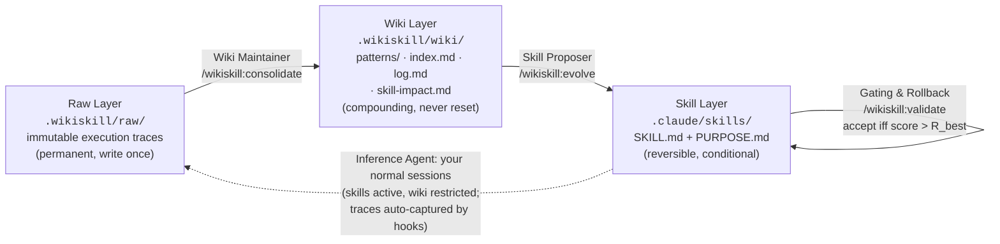

# WikiSkill

**Auto-evolving agent skills for Claude Code and opencode**, a faithful
implementation of *"WikiSkill: Compiling Agent Experience into Persistent
Knowledge for Skill Evolution"* ([arXiv:2608.27454](https://arxiv.org/abs/2608.27454),
Google Research & Virginia Tech).

Most skill-evolution setups collapse what an agent has learned into scattered
optimization history. WikiSkill's key idea is a strict **three-layer workspace**
with an orchestrated evolution loop over it (paper Figure 2 / Algorithm 1):



- **Raw Layer** — every session is captured automatically (Claude Code `Stop`
  hook / opencode `session.idle` plugin) as a digest **plus** a raw execution
  log for deep root-cause analysis. Immutable, git-ignored.
- **Wiki Layer** — the Wiki Maintainer consolidates a stratified sample of
  traces (≤5 failing + ≤3 passing per iteration, per the paper's Appendix C)
  into pattern pages (failure *and* success patterns, 10–30 lines, root cause +
  concrete fixes), a one-line-per-pattern index, an evolution log, and a
  **skill-impact tracker** that the CLI appends to programmatically — every
  proposal's unified diff, validation score, and Accepted/Rejected outcome.
  The wiki is **never rolled back**; the paper's ablation attributes the gains
  to exactly this persistence.
- **Skill Layer** — the Skill Proposer makes **one atomic proposal per
  iteration** (create / patch / honest no-action), grounded in the wiki and
  forbidden from repeating any rejected diff recorded in `skill-impact.md`.
  Each skill is `SKILL.md` (When to Apply / When NOT to Apply / Instructions)
  plus `PURPOSE.md` (Origin / Patterns Addressed / Evolution History).
  Snapshots are taken before every change; gating accepts a change only if the
  validation score **strictly beats R_best**, else it rolls back — while the
  wiki keeps what was learned, including the failure itself.

Two paper-faithful details worth knowing: new sessions do **not** get the wiki
injected (the paper's §5.1 ablation shows inference-time wiki access degrades
evolved-skill quality — opt in via `inject_wiki_context` in config), and
evolution early-stops when R_best reaches 1.0 until you add harder validation
tasks.

## Install — Claude Code

```text
/plugin marketplace add IvanLukianenko/WikiSkill
/plugin install wikiskill@wikiskill
```

Then, in each project where you want skills to evolve:

```text
/wikiskill:init
```

Init is a **full zero-touch setup**: it creates the workspace, walks you
through every important setting in two short question rounds (automation
mode, loop cadence, agent models, harvesting, wiki injection — each option
with its consequence and a recommended default, auto-applied in headless
runs), seeds the validation suite from the project's own tooling (verified
test/lint/build commands, as regression gates), and explains everything —
after it, the loop runs itself and there is nothing to configure by hand.

Requires `python3` on PATH (stdlib only, no dependencies).

## Install — opencode

```bash
git clone https://github.com/IvanLukianenko/WikiSkill
WikiSkill/opencode/install.sh /path/to/your/project
```

This installs `/wikiskill-*` commands, the trace-capture plugin
(`.opencode/plugin/wikiskill.js`), and initializes the workspace. Evolved
skills default to `.claude/skills/`; point `skills_dir` in
`.wikiskill/config.json` at `.opencode/skill` for opencode-native skills.
Both tools can share one `.wikiskill/` workspace in the same repo.

## Usage

1. **Work normally.** Your sessions are the training rollouts; each leaves a
   trace in `.wikiskill/raw/traces/`.
2. **Evolve periodically:** run `/wikiskill:loop` (Claude Code) or
   `/wikiskill-loop` (opencode) — or let the auto-loop trigger below do the
   asking. One run = one iteration of Algorithm 1: baseline (first time) →
   consolidate → propose → validate → gate.
3. **Validation suite** (`.wikiskill/validation/tasks.md`) — this is the
   paper's validation split, and gating is only as good as it is. You can
   author tasks by hand for the strongest gating, but you don't have to: while
   the suite has fewer than 3 tasks, the loop **harvests tasks automatically**
   from your real, completed sessions (self-contained prompt + objectively
   checkable success criteria observed in the trace, marked "auto-generated";
   disable via `auto_generate_validation: false`). With no tasks at all,
   updates fall back to a soft self-review of the skill diff.

## Automating the loop

The plugin can drive the cadence itself — configured in `.wikiskill/config.json`:

```jsonc
"auto_loop": "suggest",      // "suggest" (default) | "auto" | "off"
"loop_every_sessions": 5,    // due when >= N session traces are pending (0 = off)
"loop_every_days": 3         // due when >= D days since the last loop AND >= 1 trace pending (0 = off)
```

The SessionStart hook checks both triggers at the start of every session
(long-running sessions get caught by the day trigger at their *next* start):

- **suggest** — when a loop is due, Claude briefly proposes running
  `/wikiskill:loop` at the first natural moment; nothing runs uninvited.
- **auto** — when due, Claude runs one full loop iteration by itself *after*
  finishing your current request, then reports the outcome. Your task is never
  interrupted or preceded by loop work.

The counter resets whenever a loop actually does work (`mark-consolidated` /
`record-validation` update `last_loop_at`); `python3 .wikiskill/bin/wikiskill.py
status` shows the current due-state.

For fully hands-off, calendar-based runs, schedule a headless loop with cron on
the machine where you work (traces are local and git-ignored, so this must run
where the traces live — not in CI):

```cron
0 9 * * * cd ~/your-project && python3 .wikiskill/bin/wikiskill.py loop-due && \
  claude -p "/wikiskill:loop" --permission-mode acceptEdits \
  --allowedTools "Bash" "Read" "Write" "Edit" "Glob" "Grep" "Task" >> ~/.wikiskill-cron.log 2>&1
```

`loop-due` exits 0 only when a loop is warranted, so the cron job is a no-op
(and costs nothing) on quiet days.

| Command (Claude Code / opencode) | Paper component |
|---|---|
| `/wikiskill:init` / `/wikiskill-init` | Full zero-touch setup: workspace (S₀, W₀ = ∅), automation prefs, seeded validation suite |
| `/wikiskill:status` / `-status` | Iteration k, R_best, pending traces, patterns, snapshots |
| `/wikiskill:consolidate` / `-consolidate` | Wiki Maintainer (§3.2.2): stratified sample → pattern pages, index, log |
| `/wikiskill:evolve [skill]` / `-evolve` | Skill Proposer (§3.2.3): ReAct exploration → one atomic create/patch/no-action |
| `/wikiskill:validate <skill>` or `--baseline` / `-validate` | Gating & Rollback (§3.2.4, Eq. 4): accept iff score > R_best; CLI appends diff + outcome to skill-impact.md |
| `/wikiskill:loop` / `-loop` | One full iteration of Algorithm 1, with the R_best = 1.0 early stop |
| `/wikiskill:rollback <skill> [ts]` / `-rollback` | Skill-only rollback (Alg. 1 line 16; the wiki is retained) |
| `/wikiskill:models [agent=model ...]` (Claude Code) | Per-project model choice for the evolution agents (see below) |
| `/wikiskill:help` / `-help` | Detailed how-it-works guide + where this project's loop currently stands |

### Token accounting

Skill evolution costs tokens, and the plugin keeps that visible:

- every trace digest records its session's usage summed from the transcript
  (`tokens`: input/output/cache, by the Stop hook — free and deterministic);
- measured evolution work (the consolidator/evolver/validator agent runs
  inside loop phases) is logged via `wikiskill.py record-tokens` into
  `.wikiskill/stats.jsonl`, with running totals per phase in `state.json`;
- `/wikiskill:status` shows both: the cumulative evolution cost by phase and
  the total traced-session usage. Only measured numbers are recorded — the
  commands forbid estimating.

### Choosing models for the evolution agents

Each of the three agents can run on its own model — set it per project with,
e.g., `/wikiskill:models evolver=opus consolidator=haiku` (`show` / `reset` to
inspect or clear; values: `haiku`, `sonnet`, `opus`, `inherit`, or a full model
ID). Under the hood the command writes override copies of the plugin agents
into `.claude/agents/`, which take precedence, and records the intent in
`agent_models` in the config.

Guidance from the paper: keep **validator** on `inherit` — validation is a
rollout of your everyday inference model (§3.2.4), so gating must measure what
*that* model achieves with the skill. **evolver**/**consolidator** are the
optimizer side, and §4.2.2 shows skills transfer across models (a stronger
evolver can beat self-evolution) — so a strong evolver over a cheap daily
model, or a budget consolidator, are both sound configurations.

## What's in the box

```
.claude-plugin/plugin.json        plugin manifest (+ marketplace.json for /plugin marketplace add)
commands/                         the 8 slash commands above
agents/                           subagents adapting the paper's Appendix E prompts:
                                  wikiskill-consolidator (Wiki Maintainer, E.2),
                                  wikiskill-evolver (Skill Proposer, E.3),
                                  wikiskill-validator (per-task validation)
skills/wikiskill-methodology/     the framework's rules as a skill (formats, loop, gating)
hooks/hooks.json                  Stop → capture trace + raw log; SessionStart → status note
scripts/wikiskill.py              dependency-free outer-loop harness: init, stratified
                                  sampling, snapshots, R_best gating, skill-impact diffs
scripts/capture_trace.py          Stop-hook implementation (Raw Layer writer)
scripts/session_start.py          SessionStart-hook implementation
opencode/                         opencode plugin (JS), command mirrors, install.sh
docs/PAPER.md                     section-by-section mapping to the paper + stated adaptations
```

Per-project state lives in `.wikiskill/` (created by init): `wiki/`,
`validation/`, and `state.json` are meant to be committed — the wiki *is* the
compounding asset; `raw/` and `bin/` are git-ignored automatically.

## Fidelity to the paper

[docs/PAPER.md](docs/PAPER.md) maps every paper component (three layers, the
four Algorithm 1 steps, Appendix C sampling, Appendix E prompts, Eq. 4 gating)
to its implementation here, and lists the deliberate adaptations a development
plugin needs: real sessions instead of a training split, a user-defined
validation suite instead of a benchmark scorer, native skill loading instead of
full prompt injection, and human-triggered iterations.

## References

- Paper: [arXiv:2608.27454](https://arxiv.org/abs/2608.27454) ([HTML](https://arxiv.org/html/2608.27454), [HF page](https://huggingface.co/papers/2608.27454))
- Karpathy's LLM Wiki (the paper's stated inspiration): https://gist.github.com/karpathy/442a6bf555914893e9891c11519de94f
- Claude Code plugins: https://code.claude.com/docs/en/plugins
- opencode plugins: https://opencode.ai/docs/plugins/
