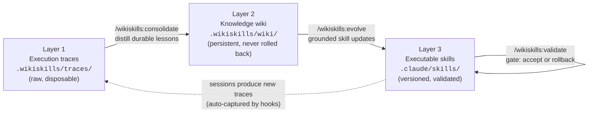

# WikiSkills

**Auto-evolving agent skills for Claude Code and opencode**, implementing the
WikiSkill framework from *"WikiSkill: Compiling Agent Experience into Persistent
Knowledge for Skill Evolution"* ([arXiv:2608.27454](https://arxiv.org/abs/2608.27454)).

Most skill-evolution setups collapse everything into one blob of optimization
history. The paper's key idea — and this plugin's architecture — is a strict
**three-layer separation** with a continual loop over it:



- **Traces** are captured automatically (a `Stop` hook in Claude Code, a
  `session.idle` plugin in opencode) as compact per-session digests: requests,
  tools used, errors, outcome.
- **The wiki** accumulates only durable lessons (Facts / Pitfalls / Procedures /
  Preferences, each with an evidence counter). It is append/refine-only and is
  injected into every new session. It is **never rolled back** — that asymmetry is
  the framework's core invariant.
- **Skills** are evolved only from wiki knowledge, snapshotted before every edit,
  and gated on a validation task suite: improved → accept, regressed → rollback
  (the wiki keeps the knowledge either way, so the next attempt builds on it).

## Install — Claude Code

```text
/plugin marketplace add IvanLukianenko/WikiSkills
/plugin install wikiskills@wikiskills
```

Then, in each project where you want skills to evolve:

```text
/wikiskills:init
```

Requires `python3` on PATH (stdlib only, no dependencies).

## Install — opencode

```bash
git clone https://github.com/IvanLukianenko/WikiSkills
WikiSkills/opencode/install.sh /path/to/your/project
```

This installs `/wikiskills-*` commands, a trace-capture plugin
(`.opencode/plugin/wikiskills.js`), and initializes the workspace. The evolved
skills default to `.claude/skills/`; point `skills_dir` in
`.wikiskills/config.json` at `.opencode/skill` if you prefer opencode-native
skills. Both tools can share one `.wikiskills/` workspace in the same repo.

## Usage

1. **Work normally.** Every session leaves a trace digest in `.wikiskills/traces/`.
2. **Define validation** (once): add tasks with objective success criteria to
   `.wikiskills/validation/tasks.md`. Without them, skill updates fall back to a
   soft self-review instead of hard gating.
3. **Evolve periodically:** run `/wikiskills:loop` (Claude Code) or
   `/wikiskills-loop` (opencode). One cycle = consolidate → evolve → validate.

| Command (Claude Code / opencode) | What it does |
|---|---|
| `/wikiskills:init` / `/wikiskills-init` | Create the `.wikiskills/` workspace (the plugin is inert until then) |
| `/wikiskills:status` / `-status` | Traces pending, wiki pages, skills, validation history |
| `/wikiskills:consolidate` / `-consolidate` | Distill pending traces into wiki entries (append/refine, evidence-counted) |
| `/wikiskills:evolve [skill]` / `-evolve` | One wiki-grounded skill change per cycle: refine, create, or honest no-op; snapshots first |
| `/wikiskills:validate <skill>` / `-validate` | Run the task suite, record the score, accept or roll back per the verdict |
| `/wikiskills:loop` / `-loop` | Full cycle: consolidate → evolve → validate |
| `/wikiskills:rollback <skill> [ts]` / `-rollback` | Restore a skill snapshot (the wiki is untouched) |

## What's in the box

```
.claude-plugin/plugin.json        plugin manifest (+ marketplace.json for /plugin marketplace add)
commands/                         the 7 slash commands above
agents/                           subagents: wikiskills-consolidator, -evolver, -validator
skills/wikiskills-methodology/    the framework's rules (wiki formats, evolution & gating rules)
hooks/hooks.json                  Stop → capture trace digest; SessionStart → inject wiki index
scripts/wikiskills.py             dependency-free CLI: init, snapshots, rollback, validation records
scripts/capture_trace.py          Stop-hook implementation
scripts/session_start.py          SessionStart-hook implementation
opencode/                         opencode plugin (JS), command mirrors, install.sh
docs/PAPER.md                     detailed mapping from the paper to this implementation
```

Per-project state lives in `.wikiskills/` (created by init): `wiki/` and
`validation/` + `state.json` are meant to be committed — the wiki *is* the
compounding asset; `traces/` and `bin/` are git-ignored automatically.

## How this maps to the paper

See [docs/PAPER.md](docs/PAPER.md) for the full mapping. In short: hooks implement
experience collection; the consolidate command/agent implements wiki
consolidation; the evolve command/agent implements wiki-grounded skill proposal;
`record-validation` + `snapshot`/`rollback` implement validation gating with
skill-only rollback; the SessionStart hook closes the loop by making accumulated
knowledge ambient in every future session.

## References

- Paper: [arXiv:2608.27454 — WikiSkill: Compiling Agent Experience into Persistent Knowledge for Skill Evolution](https://arxiv.org/abs/2608.27454) ([HTML](https://arxiv.org/html/2608.27454), [HF paper page](https://huggingface.co/papers/2608.27454))
- Claude Code plugins: https://code.claude.com/docs/en/plugins
- opencode plugins: https://opencode.ai/docs/plugins/
